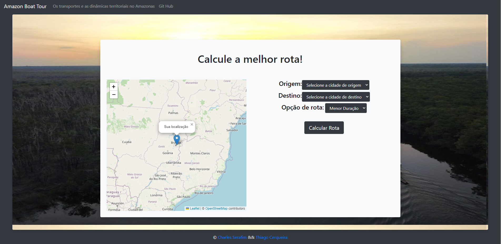
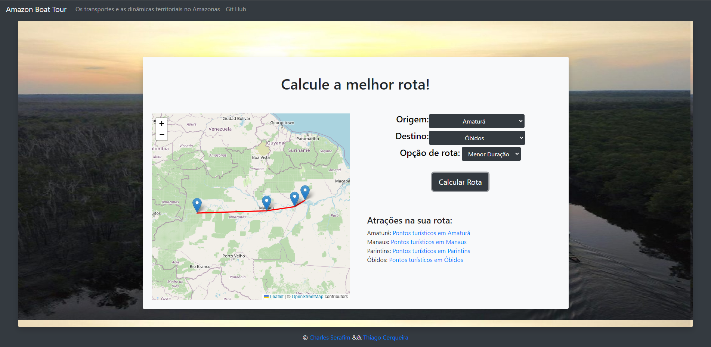
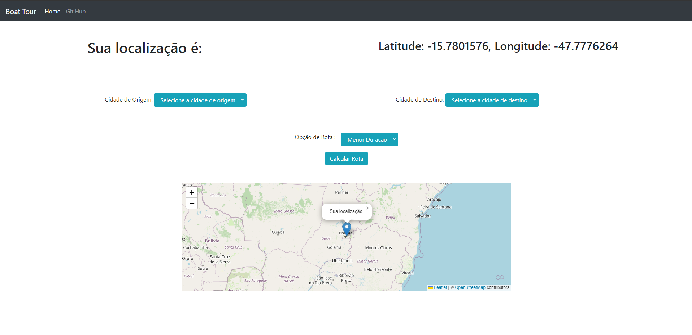

# Amazon Boat Tour

**Número da Lista**: X 
**Conteúdo da Disciplina**: Grafos 2 

## Alunos

| Matrícula | Aluno                   |
| --------- | ----------------------- |
| 190113596 | Charles Serafim Morais  |
| 190117508 | Thiago Cerqueira Borges |

## Sobre 

O objetivo do trabalho é fornecer uma aplicação que permita ao usuário calcular possíveis roteiros de viagem entre cidades amazônicas acessíveis através de viagens de barco, transporte bastante utilizado em algumas cidades devido à presença de diversos rios na região. A aplicação fornece ainda acesso a matérias e artigos indicando pontos turísticos das cidades a serem visitadas no roteiro gerado.

Para os cálculos dos caminhos de menor duração ou de menor preço total, foi utilizado o [algoritmo de Dijkstra](https://pt.wikipedia.org/wiki/Algoritmo_de_Dijkstra), como forma de aplicação prática dos conteúdos abordados no módulo Grafos 2 da disciplina de Projeto de Algoritmos, do curso de Engenharia de Software da Universidade de Brasília.

O mapa, assim como a visualização das rotas, foi feito utilizando as ferramentas [Leaflet](https://leafletjs.com/) e [Open Street Map](https://www.openstreetmap.org/).

A consulta das rotas, preços e duração das viagens foi realizada nos sites [E-commerce Navegam](https://navegam.com.br/) e [iBarco](ibarco.com.br/).

Caso queira contribuir com fontes de consulta a rotas, valores e duração de viagens de barco entre cidades da Amazônia, entre em contato com os contribuidores do projeto.

## Vídeo de apresentação

A execução do programa e explicação da aplicação dos algoritmos e código podem ser vistas no [arquivo do vídeo da apresentação, constante dentro desse repositório](LINK).

## Screenshots

Página inicial

Consulta das rotas pela menor duração

Consulta das rotas pelo menor preço total

## Instalação 

Para rodar o projeto localmente:

**Linguagem**: JavaScript  
**Framework**: Bootstrap  

## Uso 

A aplicação pode ser utilizada no GitHub Pages do projeto, acessível através deste [link](https://projeto-de-algoritmos.github.io/Grafos2_Amazon-Boat-Tour/).

Uma vez dentro da aplicação, para gerar os roteiros, basta seguir os seguintes passos:

1° - Selecione local de origem. 
2° - Selecione local de destino. 
3° - Selecione a opção de Rota. 
4° - Selecione Calcular Rota. 
