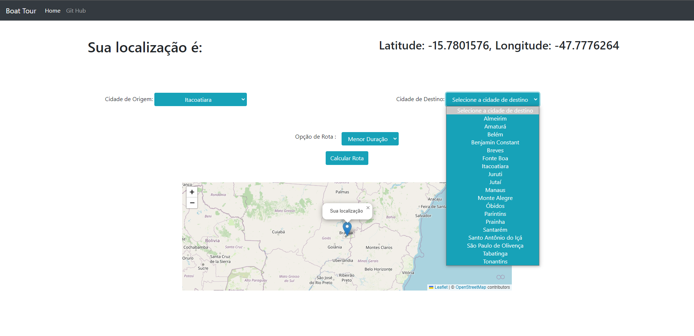
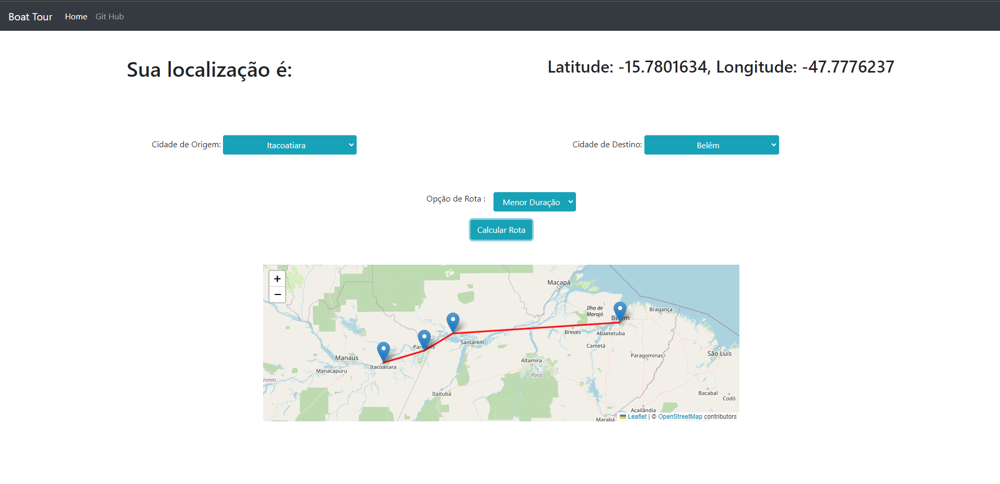

# Boat Tour

**Número da Lista**: X 
**Conteúdo da Disciplina**: Grafos 2 

## Alunos
|Matrícula | Aluno |
| -- | -- |
| 190113596  |  Charles Serafim Morais  |
| 190117508  |  Thiago Cerqueira Borges |

## Sobre 
Descreva os objetivos do seu projeto e como ele funciona. 

## Screenshots

## Instalação 
**Linguagem**: JavaScript  
**Framework**: Bootstrap  
Descreva os pré-requisitos para rodar o seu projeto e os comandos necessários.

## Uso 
1° - Selecione local de origem. 
2° - Selecione local de destino. 
3° - Selecione a opção de Rota. 
4° - Selecione Calcular Rota. 

## Outros 
Quaisquer outras informações sobre seu projeto podem ser descritas abaixo.

